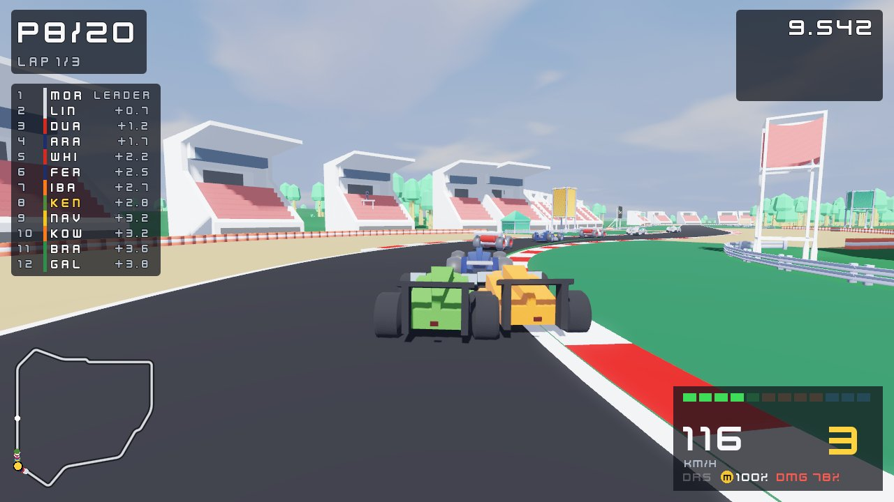

# Race Day

*Qualify on Saturday. Win on Sunday. Do it sixteen times.*

A grand prix racing game in Kenney's bright low-poly style, for Linux PCs and
handhelds, made with Godot 4. The concept is idea 20 in
[game-ideas](https://github.com/LinuxGroove/game-ideas/blob/main/ideas/20-race-day.md).



Screenshots of every circuit, layout, camera and menu are in
[docs/screenshots](docs/screenshots/README.md).

## How it plays

- **Sixteen circuits and the Proving Ground**, 33 layouts in all: parkland,
  harbour streets, a forest valley, an old airfield, a figure of eight, a
  desert night race, a city at night, thin mountain air, a banked oval and
  more. Most venues have a second layout (a reverse, a club or short loop).
- **Race weekends**: qualifying (one flying lap, a timed session, or a
  knockout in three parts), then the race from a standing start under five
  red lights. Tyres wear, compounds matter, the crew changes them in the pit
  lane, and longer races need two kinds of dry tyre. Rain comes and goes.
  Yellow and blue flags, track limits, pit lane speeding, the safety car and
  the virtual safety car.
- **Modes**
  - **Championship**: a season of the sixteen rounds for a team you pick.
  - **Career**: start at Tankco, the slowest team, and earn offers from
    better ones. Points also buy upgrades between rounds.
  - **Quick Race**: any layout, any length, any weather.
  - **Time Trial**: hot laps against your best lap's ghost, with online lap
    boards.
  - **Racing School**: eight short tests (braking, the esses, a fast corner,
    no help, a pass, a pit stop, the wet, and a real lap) with bronze,
    silver and gold.
  - **Multiplayer**: two players in split screen, LAN, online rooms with a
    join code, and quick match (a short search for other players, then a
    race with AI drivers filling the grid).
- **AI drivers** from 0 to 110, with no rubber-banding: they brake, pass,
  defend, make mistakes and pit on their own strategy.
- **Assists** to learn with, each one on its own switch: the braking line,
  braking and steering help, anti-lock brakes, traction control, automatic
  gears, a pit lane that drives itself, and rewind.
- **Car setup**: three presets and four settings (wing, gearing, brake
  balance, stiffness), kept for each layout.
- **Four cameras**: chase near, chase far, the T-cam and the cockpit. The
  horizon stays level, there is no shake or head bob, and the chase camera
  is soft by default, so it's gentle on anyone who gets motion sick.

When the game starts with the internet on, it tells the LinuxGroove game
server once, so we can count how many people play and on what: a random id
made on the first run, the game's version, the OS and the CPU, and nothing
else. It never signs in, and with no network nothing is sent. Set
`DO_NOT_TRACK=1` to turn it off. Everything except online play works with no
network at all.

## Controls

Controller first; the keyboard always works. Kerbs, the grass, locked wheels
and contact come through the controller's rumble, never the camera.

| Action | Controller | Keyboard |
|---|---|---|
| Steer | Left stick | A and D, or Left and Right |
| Throttle | RT | W or Up |
| Brake (hold when stopped to reverse) | LT | S or Down |
| Shift up, shift down (manual gears) | A, X | E, Q |
| DRS | RB | F |
| Pit limiter | LB | L |
| Ask to pit this lap | D-pad down | P |
| Tyres for the next stop | D-pad right | T |
| Change camera | Y | C |
| Look behind (hold) | B | B |
| Look left, right | Right stick | Z, X |
| Rewind (offline) | View / Back | R |
| Timing tower | D-pad up | Tab |
| Pause | Menu / Start | Esc |

## Building and testing

You need Godot 4.7.

```sh
godot --headless --path . --import
godot --headless --path . tools/check_scripts.tscn             # every script compiles
godot --headless --path . tests/run_tests.tscn -- --games=2    # unit tests, school runs and whole AI races
godot --path . -- --quick --circuit=monte_pineta --laps=3      # straight into a Quick Race
godot --path . -- --quick --split                              # the same in split screen
godot --path . -- --tt --circuit=port_lumen                    # straight into Time Trial
```

`tools/screenshot.tscn` saves screenshots of menus and races without a
screen (run it under `xvfb-run`; its options are at the top of
`tools/screenshot.gd`), and `tools/circuit_check.gd` checks every layout
with an AI lap.

## Snap

`snapcraft pack` builds a strictly confined snap, `race-day`, with the
exported game. See [docs/packaging.md](docs/packaging.md).

Pushing to `main` builds the snap and publishes it to the `edge` channel; a
GitHub release publishes to `candidate`. The **Windows and macOS** workflow
exports both from Linux and attaches the zips to releases.

## Layout

| Path | What |
|---|---|
| `game/race/` | `Race` (the whole weekend's rules, with no nodes), teams and drivers, weather |
| `game/car/` | `CarSim` (the car on the 120 Hz tick), specs, tyres, the car's model and livery |
| `game/ai/` | `AiDriver` |
| `game/track/` | `Track` (the road, kerbs, pit lane, sectors, DRS), plans for every circuit, the racing line |
| `game/world/` | Scenery, lighting and weather round each circuit |
| `game/play/` | The race scene, cameras, the player's driver and assists, ghosts, the Racing School, network sync |
| `game/audio/` | Engine and tyre sound made from samples and synthesis, crowds, radio, music |
| `game/ui/` | Title, lobby, HUD, pause menu and car setup, results, how to play |
| `game/net/` | `Session` (solo, split screen, LAN, online rooms, quick match) and the game server |
| `addons/linuxgroove/` | The shared LinuxGroove add-on (settings, input and seats, theme, LAN, online) |
| `addons/com.heroiclabs.nakama/` | Vendored Nakama client |
| `assets/` | Kenney packs (CC0) and the game's own sounds |
| `tests/`, `tools/` | Test runner, script checker, circuit check, screenshots, versioning and release scripts |
| `snap/` | Snap packaging |

Code is MIT (see `LICENSE`); assets and other credits in [CREDITS.md](CREDITS.md).
